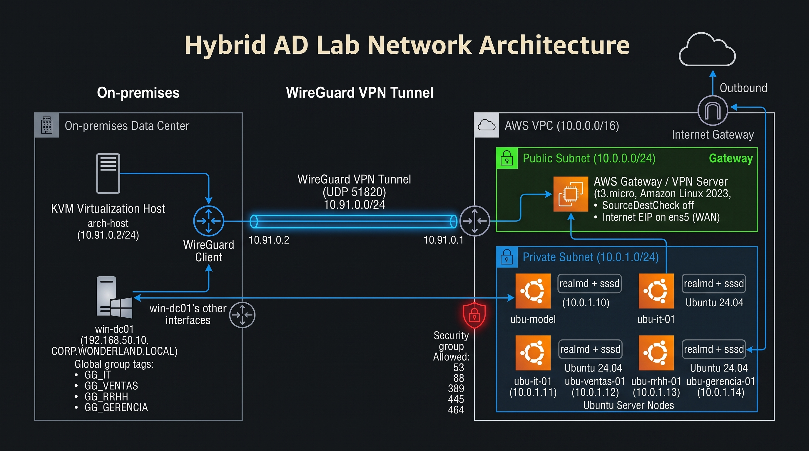

# Active-Directory-Hibrido

Un dominio de Active Directory on-premise (Windows Server 2022 sobre KVM) extendido a AWS mediante un túnel WireGuard, con clientes Ubuntu unidos al dominio por departamento, shares Samba, tráfico simulado y tickets de soporte N1.

Es un entorno de [CloudLab](../README.md): usa el mismo patrón de conectividad híbrida (túnel iniciado desde el lado local, sin puertos entrantes) y se define del lado de AWS con CloudFormation.

> ✅ **Nivel 1 completo.** El Nivel 2 está planificado (ver [Roadmap](#roadmap-nivel-2)).

## Qué es

Simula una empresa pequeña con oficina on-premise y una sucursal en la nube:

- El **controlador de dominio** (`win-dc01`, `corp.wonderland.local`) corre en una VM sobre mi propio hardware.
- La **sucursal en AWS** es una VPC con un gateway que termina el túnel WireGuard y una subred privada con cuatro clientes Ubuntu.
- Cada cliente se une al dominio en la **OU de su departamento** y solo admite el login de su grupo (más el equipo de IT).
- Sobre esa base se simula **tráfico de autenticación** y se resuelven **tickets de soporte N1** reales.

## Objetivos

- **Entender Active Directory por dentro**: OUs, usuarios, grupos globales, políticas de bloqueo, Kerberos, DNS y LDAP, no solo "unir una máquina".
- **Replicar una configuración por departamento** a partir de un mismo modelo, con un script que decide qué cambia según el departamento.
- **Conectividad híbrida real**: DC on-premise detrás de CGNAT, alcanzado desde AWS solo por el túnel que inicia el host.
- **Soporte N1 con método**: cada ticket se documenta con síntoma, diagnóstico, comando y verificación.
- **Documentar los errores**: la bitácora registra 30 problemas con su causa raíz y cómo prevenirlos.

## Arquitectura



> El diagrama es el **plan original**. La versión final difiere en detalles: por ejemplo, el modelo `ubu-model` se reemplazó por cuatro clones lanzados desde Ubuntu 24.04 con *user data*, porque el sandbox de AWS no permite lanzar instancias desde AMIs propias.

```
  ON-PREMISE (host KVM)                                AWS (VPC 10.0.0.0/16)
 +----------------------------+                +--------------------------------------+
 | win-dc01   192.168.50.10   |                | Subnet pública 10.0.0.0/24           |
 | corp.wonderland.local      |                |   Gateway (AL2023, 2 ENIs, EIP)      |
 |   red libvirt lab-hybrid   |   WireGuard    |   10.91.0.1  <-- termina el túnel    |
 |                            |   10.91.0.0/24 |                                      |
 | host Wonderland 10.91.0.2  |<==============>| Subnet privada 10.0.1.0/24           |
 | (inicia el túnel; CGNAT)   |   UDP 51820    |   ubu-it-01       10.0.1.11          |
 +----------------------------+                |   ubu-ventas-01   10.0.1.12          |
                                               |   ubu-rrhh-01     10.0.1.13          |
                                               |   ubu-gerencia-01 10.0.1.14          |
                                               +--------------------------------------+
```

## Tecnologías

| Capa | Herramientas |
|---|---|
| Virtualización on-premise | QEMU/KVM, libvirt (red `lab-hybrid`), Windows Server 2022 |
| Identidad | Active Directory (OUs, grupos `GG_*`, política de bloqueo), Kerberos, LDAP, DNS |
| Conectividad | WireGuard (interfaz `wg-hybrid`), iptables en el gateway, UFW y nftables en el host |
| AWS | CloudFormation, VPC, EC2 (Amazon Linux 2023 y Ubuntu 24.04), Security Groups, SSM |
| Clientes Linux | realmd, sssd, adcli, Samba con winbind |

## Qué se construyó (Nivel 1)

**Dominio.** `corp.wonderland.local` con 4 OUs (IT, Ventas, RRHH, Gerencia), un usuario por departamento, grupos globales `GG_<departamento>`, bloqueo de cuenta tras 5 intentos y contraseña mínima de 8 caracteres.

**Túnel y red.** Interfaz `wg-hybrid` (`10.91.0.0/24`) independiente de los demás túneles del laboratorio. El gateway de AWS tiene dos interfaces (WAN y LAN), reenvía y hace NAT de salida; la clave del servidor se genera en el primer arranque, nunca viaja por CloudFormation.

**Clientes por departamento.** Cada instancia se lanza desde la misma plantilla; el script `dept-config.sh` (embebido en el *user data*) configura el nombre del equipo, el DNS, la unión al dominio en la OU correcta y el control de acceso:

| Cliente | IP | OU | Entra por login |
|---|---|---|---|
| `ubu-it-01` | 10.0.1.11 | IT | `GG_IT` |
| `ubu-ventas-01` | 10.0.1.12 | Ventas | `GG_Ventas` + `GG_IT` |
| `ubu-rrhh-01` | 10.0.1.13 | RRHH | `GG_RRHH` + `GG_IT` |
| `ubu-gerencia-01` | 10.0.1.14 | Gerencia | `GG_Gerencia` + `GG_IT` |

**Shares Samba.** Un share por departamento (`/srv/shares/<dept>`) restringido con `valid users = @"CORP\GG_<Dept>"`. Quien pertenece al grupo entra; cualquier otro recibe `NT_STATUS_ACCESS_DENIED`.

**Tráfico simulado.** Autenticaciones Kerberos, consultas DNS SRV, LDAP y SMB desde los clientes y desde el DC, capturadas sobre el túnel con `tcpdump`.

## Tickets N1

| # | Ticket | Diagnóstico | Resolución |
|---|---|---|---|
| 1 | Usuario olvidó su contraseña | Fallos acumulados en la cuenta | `Set-ADAccountPassword -Reset`, verificado con `kinit` |
| 2 | Cuenta bloqueada | Evento 4740 en el DC; `kinit` responde "credentials have been revoked" | `Unlock-ADAccount`, verificado con `kinit` |
| 3 | Cliente no resuelve el dominio | `getent hosts` falla con el DNS de la VPC; `realm discover` sigue respondiendo (caché) | Restaurar el DC como DNS con `resolvectl` |
| 4 | Alta de usuario con acceso a su share | Cuenta nueva sin grupo | `New-ADUser` + `Add-ADGroupMember`, verificado con login y `smbclient` |
| 5 | Acceso denegado por política de departamento | Usuario fuera de `GG_<dept>`: `Permission denied` y `NT_STATUS_ACCESS_DENIED` | Reincorporarlo al grupo y refrescar sssd |

El detalle de cada ticket, con comandos y salidas, está en el Anexo F de la [documentación completa](./ad-hybrid-lab-documento-v1.md).

## Estado

- ✅ DC `win-dc01` operativo, `dcdiag` sin errores
- ✅ Túnel `wg-hybrid` con handshake estable entre el host y el gateway
- ✅ 4 clientes unidos, cada uno en su OU, con la matriz de acceso verificada
- ✅ Samba por departamento con rechazo cruzado comprobado
- ✅ Simulación de tráfico y captura de evidencia
- ✅ 5 tickets N1 documentados
- 🔄 Pendiente de probar: ocultar la contraseña en el segundo prompt del join (`stty -echo` en la plantilla)

## Roadmap (Nivel 2)

Planificado, todavía sin ejecutar. Lleva el laboratorio de "funciona" a "pensado para producción y cumplimiento":

| Área | Nivel 1 | Nivel 2 |
|---|---|---|
| DNS | El DC como único DNS de los clientes | Route 53 Resolver (reenvío condicional hacia el DC) |
| Contraseñas | Una política de dominio | Fine-Grained Password Policies por OU (p. ej., Gerencia más estricta) |
| Credenciales locales | Administrador local estándar | LAPS, contraseña rotativa |
| Protocolos legacy | Sin revisar | SMBv1 deshabilitado y auditoría de NTLM |
| Auditoría | Básica | Advanced Audit Policy, VPC Flow Logs y revisión sistemática de eventos (4625, 4720, 4732) |
| Soporte | 5 tickets N1 | Escenarios N2/N3: Route 53 Resolver, FGPP, grupos privilegiados, LAPS |

**Descartado: segundo controlador de dominio en AWS.** Se evaluó una réplica de `win-dc01` en la VPC (con Sites and Services para el sitio on-premise y el sitio AWS), pero no es viable en este entorno: la edición de evaluación de 180 días no se puede lanzar en EC2 porque el sandbox no permite instancias desde AMIs propias, y la alternativa con licencia incluida cuesta más por hora y desaparece en cada reinicio del sandbox, lo que obligaría a promover y limpiar la réplica cada vez. El laboratorio mantiene un único DC on-premise.

Opcional a futuro: un segundo bosque con *forest trust* para simular una fusión de empresas. El **monitoreo** del entorno queda fuera del alcance de esta versión.

## Estructura de la carpeta

```
Active-Directory-Hibrido/
├── README.md
├── ad-hybrid-lab-documento-v1.md
├── hybrid-ad-lab-network.yaml
└── 01-diagrama-arquitectura.jpg
```

| Archivo | Contenido |
|---|---|
| [`ad-hybrid-lab-documento-v1.md`](./ad-hybrid-lab-documento-v1.md) | Bitácora completa: decisiones, comandos exactos, 30 errores con causa raíz, scripts, tickets N1 y pasos para reconstruir |
| [`hybrid-ad-lab-network.yaml`](./hybrid-ad-lab-network.yaml) | Plantilla de CloudFormation: red, gateway WireGuard y, opcionalmente, los 4 clientes Ubuntu |
| `01-diagrama-arquitectura.jpg` | Diagrama del plan original |

## Cómo replicarlo

Requisitos: un host Linux con KVM/libvirt y WireGuard, una ISO de Windows Server 2022, una cuenta de AWS y un key pair en la región del despliegue.

1. Levantar el DC on-premise en una red libvirt dedicada, promoverlo y crear OUs, usuarios y grupos (documento, secciones 3 y 5, y Anexo A).
2. Generar el par de claves del host para `wg-hybrid` (sin tocar las de otros túneles).
3. Desplegar la plantilla `hybrid-ad-lab-network.yaml` con `DeployClients=false`, pasando como parámetros la clave pública del host y el nombre del key pair.
4. Obtener la clave pública del gateway, completar `wg-hybrid.conf` en el host y levantar el túnel.
5. Actualizar el stack con `DeployClients=true` para lanzar los 4 clientes.
6. En cada cliente, ejecutar `sudo dept-config.sh` para unirlo al dominio en su OU, y configurar Samba.

Nota para quien use el AWS Learner Lab: CloudFormation no tiene `iam:PassRole`, así que el perfil de instancia se asigna a mano a cada instancia (EC2 > Actions > Security > Modify IAM role) y se reinicia. El detalle paso a paso está en el documento, Anexo E.4.

## Seguridad

- Las contraseñas que aparecen en la documentación son **exclusivamente del laboratorio**, que es descartable. No se reutilizan en ningún otro sistema.
- El único puerto expuesto en AWS es `UDP/51820` del gateway; el resto del acceso, incluido SSH a los clientes, pasa por el túnel.
- Las claves privadas de WireGuard y el key pair de EC2 nunca se versionan.

## Autor

Diego Vásquez · [GitHub](https://github.com/dvasquez-design) · [LinkedIn](https://linkedin.com/in/diego-vasquez-cloud)
