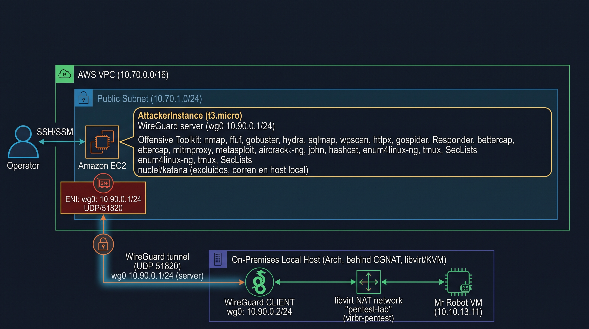
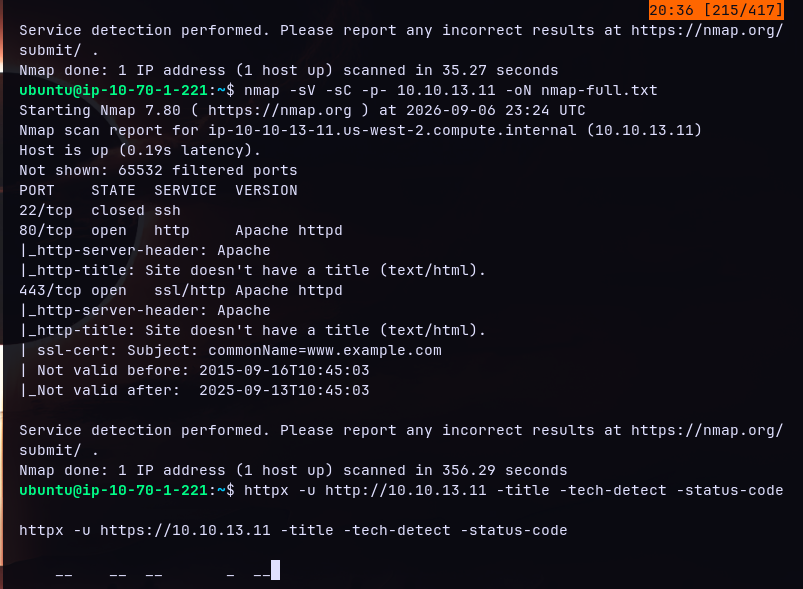
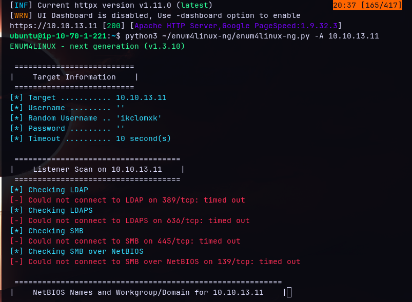
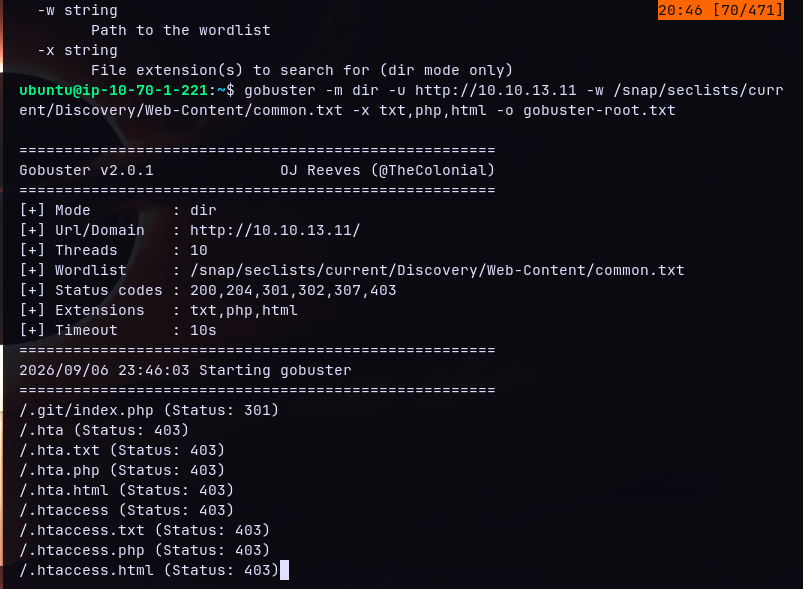
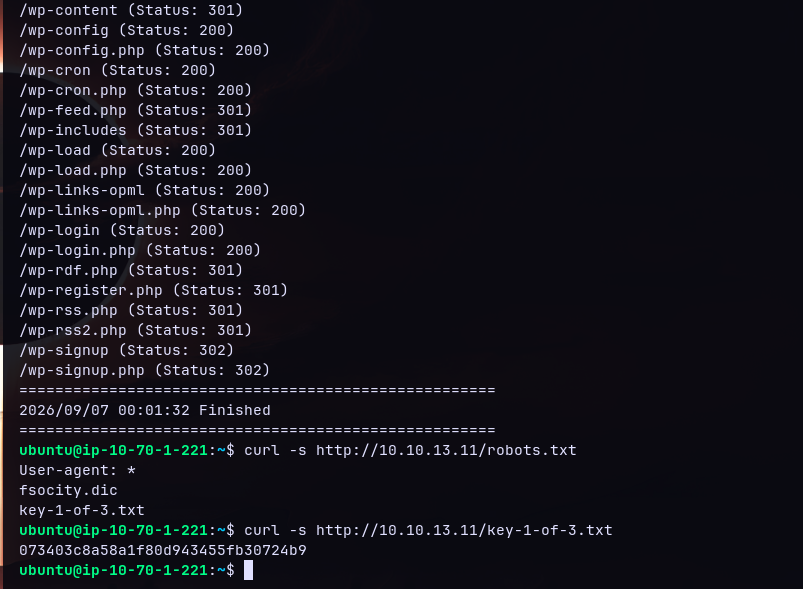
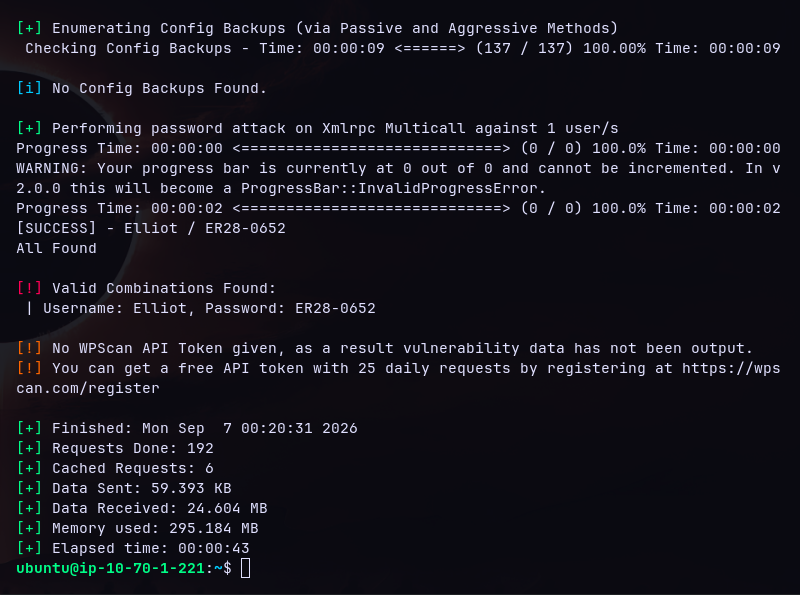
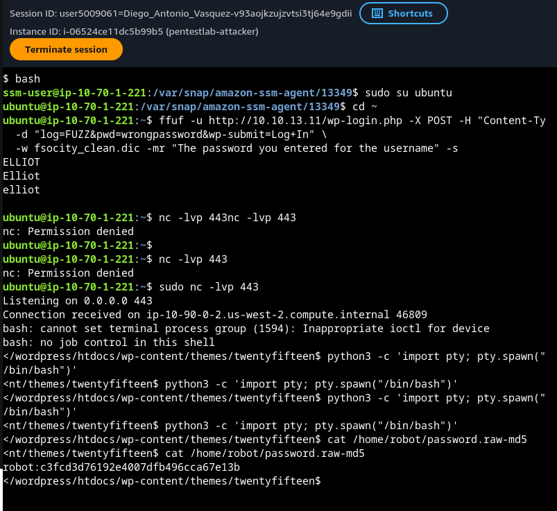

# PentestLab — Entorno de Red Team en la Nube con Toolkit 100% CLI


Entorno de pentesting bajo demanda en AWS, construido para replicar los flujos principales de Burp Suite (Intruder, Repeater, Proxy, Target/Sitemap) enteramente desde la línea de comandos, conectado mediante un túnel WireGuard autogestionado a VMs vulnerables corriendo en un homelab local KVM/libvirt.

## Índice

1. [Motivación](#motivación)
2. [Arquitectura](#arquitectura)
3. [Toolkit](#toolkit)
4. [Infraestructura como código](#infraestructura-como-código)
5. [Túnel WireGuard — la parte difícil](#túnel-wireguard--la-parte-difícil)
6. [Despliegue](#despliegue)
7. [Walkthroughs de Pentesting](#walkthroughs-de-pentesting)
8. [Lecciones aprendidas](#lecciones-aprendidas)
9. [Roadmap](#roadmap)

---

## Motivación

La GUI de Burp Suite consume muchos recursos y es difícil de scriptear de punta a punta. Este proyecto reemplaza cada módulo principal de Burp con un equivalente CLI-first (`ffuf`, `curl`, `mitmproxy`, `katana`, `nuclei`, `sqlmap`, `wpscan`, `hydra`, `metasploit`, entre otros), desplegado en una instancia EC2 desechable de AWS, y apuntado a máquinas vulnerables reales corriendo localmente — nada de "cajas vulnerables" alojadas en la nube, ni escenarios simulados.

| Módulo de Burp | Reemplazo CLI |
|---|---|
| Intruder | `ffuf`, `hydra` |
| Repeater | `curl` |
| Proxy / HTTP History | `mitmproxy` / `mitmdump` |
| Target / Sitemap | `katana`, `gospider`, `gobuster` |
| Scanner | `nuclei` |
| Decoder | `base64`, `python3 -m urllib.parse` |
| Comparer | `diff` |

## Arquitectura



- **Attacker Node**: una única instancia EC2, subred pública, sin NAT/subred privada (el objetivo real nunca está dentro de AWS).
- **VMs vulnerables**: corren localmente en libvirt (Mr Robot, Metasploitable2, DVWA, Death Note), una activa a la vez, cada una en su propia red NAT aislada.
- **WireGuard**: el EC2 (IP pública) siempre es el servidor; el host local (detrás de CGNAT) siempre es el cliente, el que inicia la conexión.

## Toolkit

Instalado vía `UserData` de CloudFormation — totalmente reproducible, sin configuración manual más allá de la creación única del key pair:

`nmap` · `ffuf` · `gobuster` · `hydra` · `sqlmap` (rama dev) · `wpscan` · `httpx` · `gospider` · `Responder` · `bettercap` · `ettercap` · `mitmproxy` · `metasploit-framework` · `aircrack-ng` · `john` · `hashcat` · `enum4linux-ng` · `tmux` · SecLists

`nuclei` y `katana` quedaron deliberadamente excluidos — su árbol de dependencias es demasiado pesado para una `t3.micro` y agotó repetidamente CPU/RAM durante la instalación (confirmado por caídas simultáneas de la conexión SSM/SSH). Ambos corren en cambio en una máquina local dedicada.

## Infraestructura como código

Un único template de CloudFormation (`pentest-template.yaml`):
- VPC con una única subred pública (sin NAT, sin subred privada — eliminadas deliberadamente una vez que el objetivo real se trasladó al homelab vía WireGuard).
- Security Group: SSH restringido a la IP del operador, UDP 51820 (WireGuard) abierto.
- EC2 con créditos de CPU ilimitados, volumen raíz gp3 de 30GB, toolkit completo + configuración del servidor WireGuard incluidos en `UserData`.
- Diseñado para entornos sandbox restringidos (probado contra un AWS Academy Learner Lab — maneja con gracia su restricción de `iam:PassRole`, dejando la asignación del instance profile como paso manual opcional cuando CloudFormation no puede hacerlo).

## Túnel WireGuard — la parte difícil

Levantar el handshake fue la parte fácil. El verdadero bloqueante: el propio **filtrado nftables de libvirt** en redes virtuales de tipo NAT (tabla `libvirt_network`, cadena `guest_input`) rechaza por defecto cualquier conexión entrante *nueva* — solo se permite tráfico de retorno establecido/relacionado. Esto absorbía silenciosamente cada paquete que llegaba por el túnel, sin relación alguna con UFW o Docker (ambos fueron pistas falsas investigadas primero).

Solución: un hook de red de `libvirt` (`/etc/libvirt/hooks/network`) que inserta una regla de excepción en `nftables` cada vez que arranca la red objetivo — usando `oifname` (coincide por nombre de interfaz, persiste entre reinicios), no `oif` (coincide por índice numérico, se rompe en el siguiente reinicio).

Documento completo: [`wireguard-tunnel-pentestlab.md`](./wireguard-tunnel-pentestlab.md).

## Despliegue

```bash
# 1. Crear un key pair con el nombre exacto que espera el parámetro KeyName
# 2. Desplegar el stack
aws cloudformation deploy \
  --template-file pentest-template.yaml \
  --stack-name pentest-lab \
  --parameter-overrides KeyName=pentestlab-key AllowedSshIp=<tu-ip>/32 \
  --capabilities CAPABILITY_IAM
```
Referencia completa de parámetros y checklist post-despliegue en [`pentestlab-sesion-reporte.md`](./pentestlab-sesion-reporte.md).

## Walkthroughs de Pentesting

- [x] **Mr Robot (VulnHub)** — resuelto end-to-end a través del túnel completo (EC2 ↔ WireGuard ↔ homelab): las 3 keys obtenidas, root confirmado vía escalación SUID de `nmap`, y acceso SSH root persistido para el análisis credenciado con Nessus. Walkthrough completo, comando por comando, en [`mrrobot-ruta-explotacion.md`](./mrrobot-ruta-explotacion.md).
- [ ] Metasploitable2
- [ ] DVWA
- [ ] Death Note

Cada writeup incluye: comandos reales ejecutados, output relevante, y el reemplazo CLI usado en lugar de cada módulo de Burp Suite.

**Próximo paso sobre Mr Robot:** análisis de vulnerabilidades credenciado con Nessus (corriendo en Azure, alcanzando el homelab vía el mismo patrón de túnel WireGuard) todavía pendiente de ejecutar — la infraestructura y el usuario SSH dedicado para el acceso root que usará el scan ya están configurados.

### Evidencia — Mr Robot

| Paso | Captura |
|---|---|
| Recon inicial con `nmap` |  |
| Recon de tecnologías con `httpx` + inicio de enumeración con `enum4linux-ng` |  |
| Enumeración SMB/NetBIOS con `enum4linux-ng` |  |
| Enumeración de directorios con `gobuster` (inicio) |  |
| Resultado de `gobuster` (rutas WordPress) y `robots.txt` → `key-1-of-3.txt` (**Key 1**) |  |
| Enumeración de usuario WordPress con `ffuf` → `Elliot` |  |
| Fuerza bruta de contraseña con `wpscan` → `Elliot / ER28-0652` |  |
| Reverse shell vía Theme Editor RCE y hash de `robot` extraído (`cat password.raw-md5`) |  |

## Lecciones aprendidas

- Diagnosticar por evidencia (`tcpdump`, contadores de `iptables`/`nft`), no por ensayo y error — la causa raíz real del fallo de WireGuard estaba tres capas más abajo de donde parecía.
- Todo lo que no está en el IaC se pierde: un resize de EBS hecho a mano en consola desapareció al recrear el stack.
- No todas las herramientas "livianas en apariencia" lo son en una `t3.micro` — el árbol de dependencias importa más que el tamaño del binario final.

## Roadmap

- Elastic IP para el Attacker Node (la IP pública actual cambia en cada stop/start).
- Extender el mismo patrón de hook de WireGuard/libvirt al AD lab y al futuro homelab de Kubernetes.
- Integrar Wazuh/Suricata/Nagios como capa de detección corriendo en paralelo a las sesiones de ataque.
